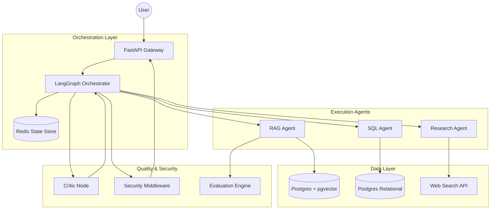
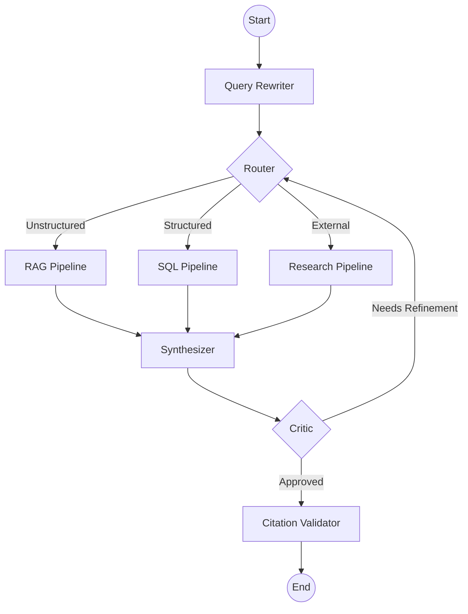
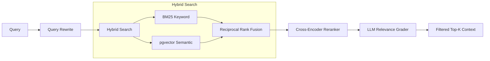
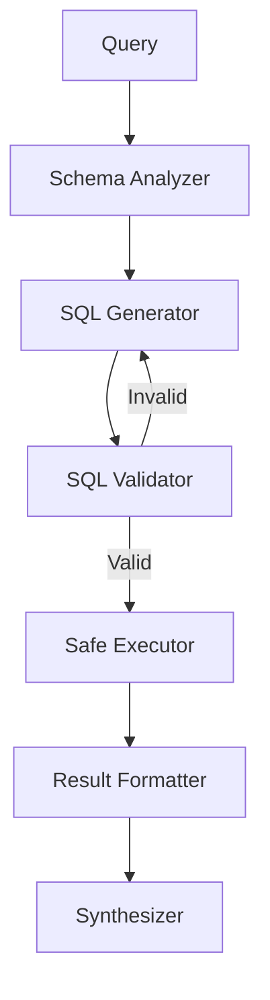
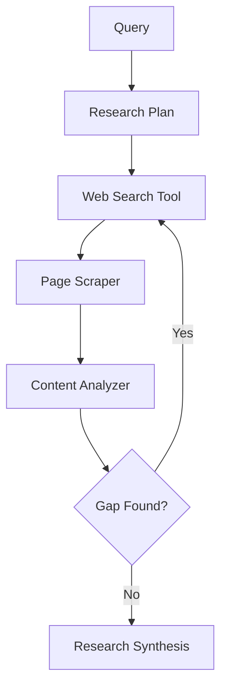
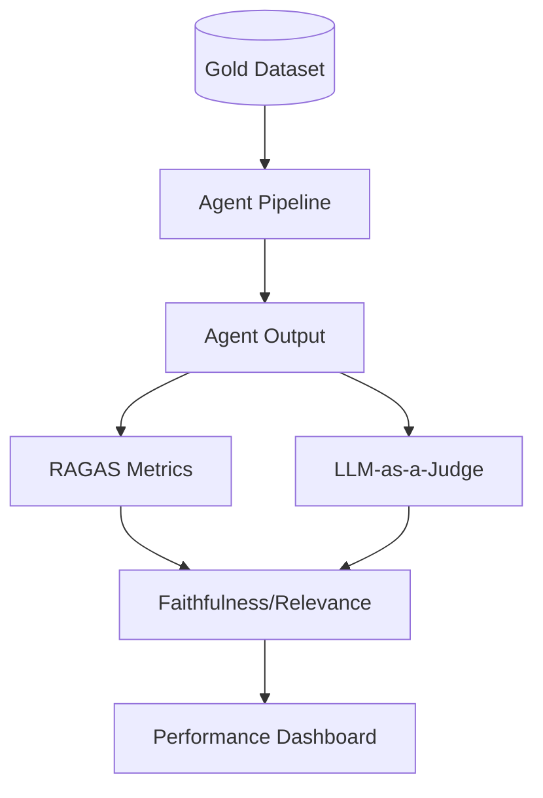
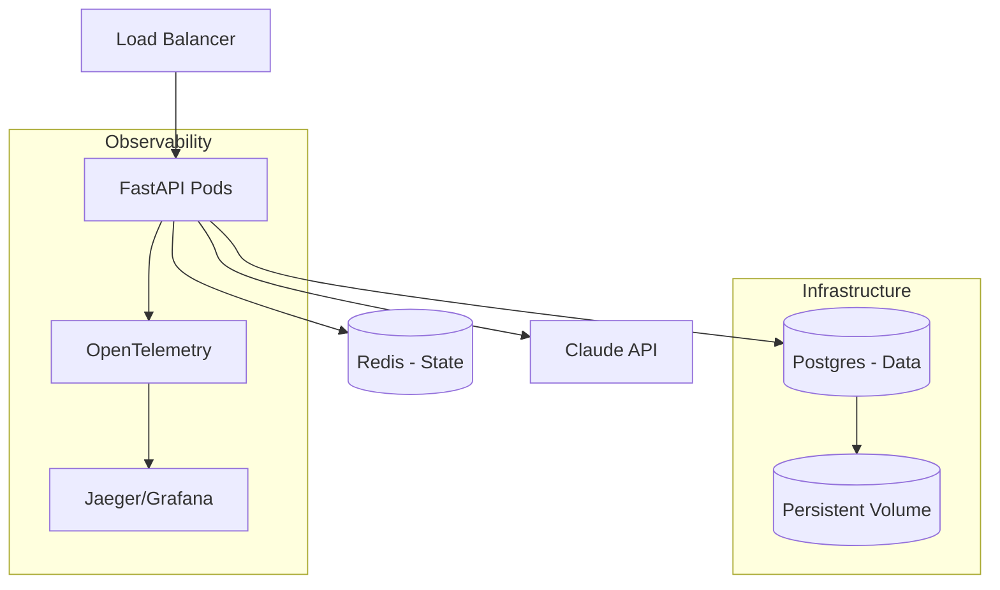

# Comprehensive System Architecture

This document defines the architectural blueprint for the Enterprise Intelligence Agent.

## 1. System Architecture
The system is a distributed agentic platform where the reasoning logic is decoupled from the execution tools.

## 2. Component Architecture
The system is divided into four primary modules:

- **API Gateway**: Handles AuthN/AuthZ, Rate Limiting, and WebSocket streaming.
- **Agentic Core (LangGraph)**: Manages the conversation state, routing logic, and iterative loops.
- **Tool Layer**: Specialized executors for Vector Retrieval, SQL execution, and Web Research.
- **Observability & Eval**: Tracks spans via OpenTelemetry and scores outputs via RAGAS.

## 3. Agent Graph (LangGraph)
The agentic flow is a cyclic graph that ensures quality via a Critic loop.

## 4. Database Schema
We use a unified PostgreSQL instance for both relational and vector data.

### Relational Schema
- `tenants`: `id, name, created_at, plan_level`
- `users`: `id, tenant_id, email, role, hashed_password`
- `documents`: `id, tenant_id, filename, metadata, created_at`
- `chunks`: `id, doc_id, content, embedding (vector), created_at`
- `queries`: `id, tenant_id, user_id, input, output, score, timestamp`

### Vector Indexing
- **Index**: HNSW (Hierarchical Navigable Small World)
- **Distance Metric**: Cosine Similarity
- **Isolation**: Row Level Security (RLS) on `tenant_id`.

## 5. Retrieval Pipeline (RAG)
A high-precision pipeline to eliminate noise and hallucinations.

## 6. SQL-Agent Pipeline
A safe, iterative process for translating natural language to enterprise data.

## 7. Research Pipeline
Iterative discovery for information not present in internal documents.

## 8. Security Architecture
Defense-in-depth for enterprise data.

- **Authentication**: OAuth2 / JWT with FastAPI Security.
- **Authorization**: RBAC (Role-Based Access Control).
- **Data Isolation**: PostgreSQL RLS.
  - Every query is prefixed with `SET app.current_tenant = 'tenant_id'`.
- **SQL Sandbox**:
  - Read-only database user for the SQL Agent.
  - Query timeout (e.g., 5s) and row limits.
- **Prompt Hardening**: System prompt delimiters and input sanitization to prevent prompt injection.

## 9. Evaluation Architecture
Quantitative measurement of agentic performance.

## 10. Deployment Architecture
Scalable, containerized infrastructure.

